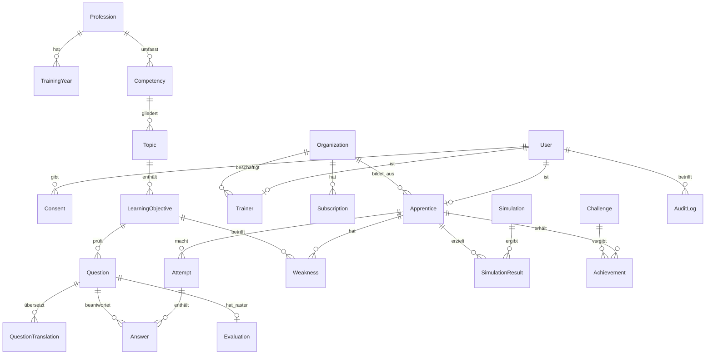

# 04 · MVP-Spezifikation, Datenmodell, Architektur

Ziel des MVP: **ein Beruf (Sanitärinstallateur/in EFZ), Deutsch, 20–50 Pilot-Lernende, 5–10 Betriebe.**
Alles, was nicht dazu dient, Gate 3 und Gate 4 zu beweisen, kommt später.

## 1. Funktionen und Abnahmekriterien

| Nr. | Funktion | Abnahmekriterium (muss erfüllt sein) | Woche |
|---:|---|---|---|
| 1 | Anmeldung per E-Mail-Link oder SMS-Code, ohne Passwort | Anmeldung in < 60 s auf iPhone und Android; kein Konto ohne Einwilligung (Nr. 16) | 5 |
| 2 | Beitritt per Betriebs- oder Klassencode | Code verknüpft Lernende/n mit Organisation; falscher Code gibt klare Meldung | 5 |
| 3 | Onboarding: Beruf, Lehrjahr, QV-Jahr, Freigaben | in < 2 Min.; Freigaben standardmässig «Trainingszeit + Themen» | 5 |
| 4 | Einstufung (12 Aufgaben quer über alle HKB) | Ergebnis setzt Startwerte je Lernziel | 6 |
| 5 | Tagestraining 10 Minuten | 8–10 Aufgaben, gemischt nach Nr. 7; Abbruch speichert Stand | 6 |
| 6 | Aufgabentypen: Auswahl (1 aus n, m aus n), Zuordnen, Zahl mit Einheit und Toleranz, Bild antippen, Reihenfolge, Kurzantwort | jeder Typ mit Tastatur und Vorlesen bedienbar; Zahl akzeptiert «1,5» und «1.5» | 5–6 |
| 7 | Adaptive Wiederholung | Lernziel-Stand nach Abschnitt 4; falsch beantwortete Aufgaben kommen nach 1, 3, 7, 16 Tagen wieder | 7 |
| 8 | Rückmeldung mit Erklärung und Verweis auf Lernziel | nach jeder Aufgabe; «Fehler melden» mit Freitext | 6 |
| 9 | Themenübersicht nach Handlungskompetenzbereich | Balken sicher / im Aufbau / offen; Tippen startet Paket | 7 |
| 10 | QV-READY Berufskenntnisse | nach Abschnitt 4; erst sichtbar ab 60 % bearbeiteter Lernziele; Hinweistext immer sichtbar | 8 |
| 11 | Semester-Check und Simulation | zeitlich begrenztes Paket zu gewählten HKB, Auswertung nach Thema | 9 |
| 12 | Fachgespräch-Training (Text) mit KI | Nachfragen und Bewertung nach geprüftem Raster (05-ki-konzept.md); Musterantwort sichtbar | 10 |
| 13 | Berufsbildner-Ansicht | nur freigegebene Werte; Wochenmail; Export CSV der eigenen Lernenden | 10 |
| 14 | Tage in Folge, Wochenziel, Abzeichen | ausblendbar | 10 |
| 15 | Erinnerungen (Push/E-Mail/SMS) | Zeit wählbar, ausschaltbar, nie zwischen 21:00 und 06:00 | 11 |
| 16 | Einwilligung, Datenschutz, Konto löschen, Daten herunterladen | Löschung in der App, Export als JSON und CSV | 5, 11 |
| 17 | Redaktions-Werkzeug für Inhalte | Workflow nach 06-content-system.md; nur freigegebene Aufgaben erscheinen | 3–4 |
| 18 | Betriebslizenz und Rechnung | Admin legt Lizenz an, QR-Rechnung als PDF | 11 |

**Später:** Sprache im Fachgespräch, Duelle, Klassen-Challenge, Heizung und weitere Berufe, Französisch und
Italienisch, Zahlung per Karte/TWINT für B2C, native Apps in den Stores.

## 2. Architektur

| Baustein | Wahl | Grund |
|---|---|---|
| Oberfläche | TypeScript, React, Vite, PWA | ein Code für alle Geräte; offline-fähig |
| Server | TypeScript (Node.js, Fastify) | gleiche Sprache wie die Oberfläche |
| Datenbank | PostgreSQL | Relationen, JSONB für Aufgabeninhalte |
| Hosting | Schweizer Rechenzentrum (z. B. Infomaniak, Exoscale oder AWS Region Zürich; Offerten vergleichen) | Daten von Minderjährigen bleiben in der Schweiz |
| Dateien (Bilder) | Objektspeicher am gleichen Standort | – |
| KI | Claude API über eigenen Server, nie direkt aus dem Browser | Schlüssel geschützt, Daten minimiert (05-ki-konzept.md) |
| E-Mail/SMS | Schweizer oder EU-Anbieter mit Vertrag zur Auftragsbearbeitung | – |
| Anmeldung | Einmal-Link/Code, Sitzung als httpOnly-Cookie | kein Passwort, weniger Support |
| Protokoll | AuditLog-Tabelle für jeden Zugriff durch Betriebe und Admins | Nachweis gegenüber Lernenden |

Grundsätze:
- **Keine Texte im Code.** Alle Texte der Oberfläche in Sprachdateien (`de-CH.json`, später `fr-CH.json`,
  `it-CH.json`). Aufgaben sind mehrsprachig im Datenmodell (Tabelle `QuestionTranslation`).
- **Datums- und Zahlenformat** Schweiz (`25.09.2026`, `1'250`, Dezimalkomma im Eingabefeld akzeptiert).
- **Verschlüsselung:** TLS für alle Verbindungen; Datenbank und Backups verschlüsselt; freie Antworten
  zusätzlich auf Feldebene verschlüsselt.
- **Rollen:** `learner`, `trainer`, `org_admin`, `editor`, `expert`, `admin`. Rechte serverseitig geprüft.

## 3. Datenmodell

| Entität | Wichtige Felder | Bemerkung |
|---|---|---|
| **User** | id, email/phone (verschlüsselt), locale (`de-CH`), birth_year, created_at, deleted_at | nur Geburtsjahr, kein Datum |
| **Organization** | id, type (`company`, `school`, `uek`, `association`), name, uid (UID-Nr.), canton, code | Betriebscode für Einladungen |
| **Apprentice** | user_id, organization_id, profession_id, training_year, qv_year, share_time, share_topics, share_ready | Freigaben als einzelne Schalter |
| **Trainer** | user_id, organization_id, role | sieht nur Lernende der eigenen Organisation |
| **Profession** | id, code (SBFI-Nr.), name i18n, bivo_version, bildungsplan_version, languages | z. B. Sanitär, BiVo SR 412.101.220.73 |
| **TrainingYear** | profession_id, year (1–4), semester | für Semester-Checks |
| **Competency** | profession_id, code (z. B. `b`), name i18n, qv_weight | Handlungskompetenzbereich |
| **Topic** | competency_id, code (z. B. `b.3`), name i18n | Handlungskompetenz |
| **LearningObjective** | topic_id, code, text i18n, taxonomy (K1–K6), training_year, source_ref | Leistungsziel aus dem Bildungsplan |
| **Question** | id, learning_objective_id, type, difficulty (1–5), status (Abschnitt Content), version, bildungsplan_version, expert_checked_by, expert_checked_at, review_due_at, source_note, license | Inhalt in QuestionTranslation |
| **QuestionTranslation** | question_id, locale, stem, options (JSONB), solution (JSONB), explanation, media_ids | pro Sprache freigegeben |
| **Evaluation** | question_id, rubric (JSONB: Kriterien, Punkte, Beispiele), model_answer, version | für Kurzantwort und Fachgespräch |
| **Attempt** | id, apprentice_id, kind (`daily`, `placement`, `topic`, `simulation`, `oral`), started_at, finished_at | |
| **Answer** | attempt_id, question_id, question_version, response (JSONB, bei Freitext verschlüsselt), correct (bool/Anteil), score, ai_feedback_id, duration_ms | Freitext wird nach 12 Monaten gelöscht |
| **Weakness** | apprentice_id, learning_objective_id, mastery (0–1), stability_days, last_seen_at, next_due_at | Grundlage für Wiederholung |
| **Simulation** | id, profession_id, competencies, duration_min, question_set | |
| **SimulationResult** | simulation_id, apprentice_id, score_by_competency (JSONB), finished_at | |
| **Achievement** | apprentice_id, challenge_id oder badge_code, earned_at | |
| **Challenge** | id, organization_id (optional), goal, start, end | später |
| **Subscription** | organization_id oder user_id, plan, seats, price_chf, start, end, invoice_ref | |
| **Consent** | user_id, purpose (`account`, `share_with_trainer`, `ai_feedback`, `research_anonymous`), version, given_at, withdrawn_at, by (`self`, `parent`) | jede Einwilligung einzeln |
| **AuditLog** | id, actor_user_id, action, target_user_id, fields, at, ip_hash | 2 Jahre aufbewahren |

## 4. QV-READY Berufskenntnisse: Berechnung

**Zweck:** zeigt den Trainingsstand in der App. **Keine Note, keine Prognose, keine Garantie.**

1. **Stand je Lernziel** `m` (0–1): gleitender Wert aus den letzten Antworten, neuere zählen mehr
   (Gewicht 0,5 / 0,3 / 0,2 für die letzten drei), multipliziert mit einem Vergessensfaktor
   `exp(−Tage seit letzter Übung / Stabilität)`. Die Stabilität wächst mit jeder richtigen Wiederholung
   (1 → 3 → 7 → 16 → 35 Tage).
2. **Stand je Handlungskompetenzbereich** = Mittelwert der Lernziele, gewichtet nach Taxonomiestufe.
3. **Gesamt** = Σ (Stand HKB × Gewicht HKB) × 100. Gewichte aus dem Bildungsplan/QV; wo das QV nichts
   vorgibt, Anteil der Lektionen (Sanitär: 410 Lektionen «Planen, Abschlussarbeiten» und 390 Lektionen «Installieren, Montieren» laut BiVo).
4. **Abdeckung:** Anzeige erst, wenn ≥ 60 % der Lernziele des aktuellen Lehrjahres bearbeitet sind;
   sonst «Noch zu wenig Daten».
5. **Unsicherheit:** Bereich statt Punktwert, wenn wenige Antworten (z. B. «55–70»).
6. **Prüfung der Aussagekraft** nach dem QV 2027: Vergleich mit den Semesternoten und dem Ergebnis,
   nur mit ausdrücklicher Einwilligung (Consent `research_anonymous`). Hält der Zusammenhang nicht,
   wird der Wert umbenannt oder entfernt.

## 5. Mehrsprachigkeit

- MVP Deutsch. Alle Texte als Schlüssel (`home.today.title` → «Dein heutiges Training»).
- Aufgaben: Übersetzung ist eine **neue Version** mit eigener Fachprüfung, nicht automatisch freigegeben.
- Französisch zuerst (Romandie: «installateur sanitaire CFC»), dann Italienisch.
- Fachbegriffe aus den offiziellen Sprachfassungen der BiVo übernehmen (Fedlex hat DE/FR/IT).

## 6. Nicht-funktionale Anforderungen

| Bereich | Anforderung |
|---|---|
| Geschwindigkeit | Start < 2 s auf einem 4 Jahre alten Android-Handy; Aufgabe < 300 ms |
| Offline | Tagestraining lädt vorab; Antworten werden nachgesendet |
| Barrierefreiheit | WCAG 2.2 AA: Kontrast, Tastatur, Vorlesen, Schriftgrösse |
| Verfügbarkeit | 99,5 % im Pilot; tägliche Sicherung, Wiederherstellung getestet |
| Sicherheit | OWASP Top 10 geprüft; Rechte serverseitig; Rate-Limits auf KI-Endpunkten |
| Tests | automatische Tests für Wiederholungslogik, QV-READY und Rechte |
